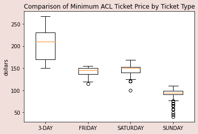
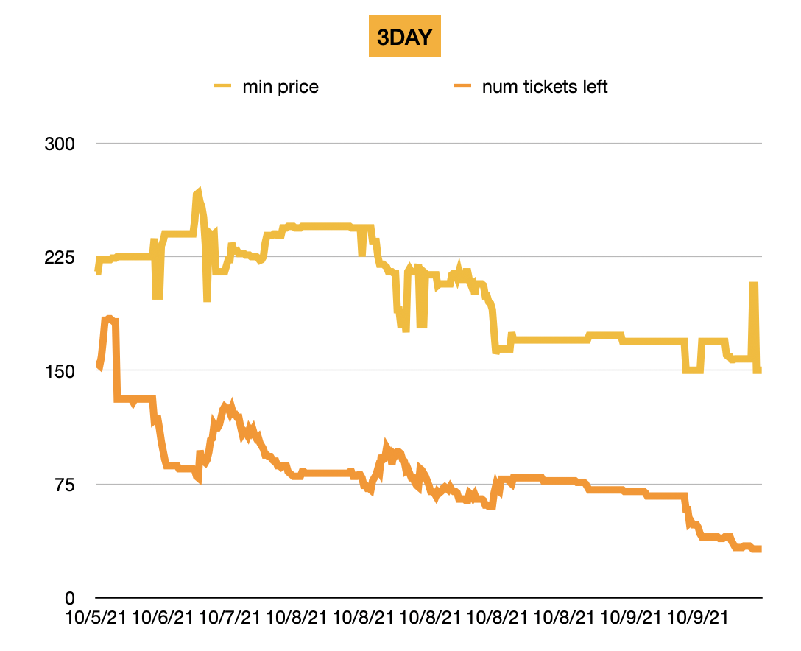
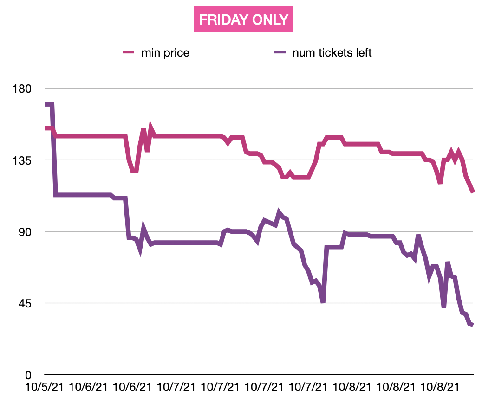
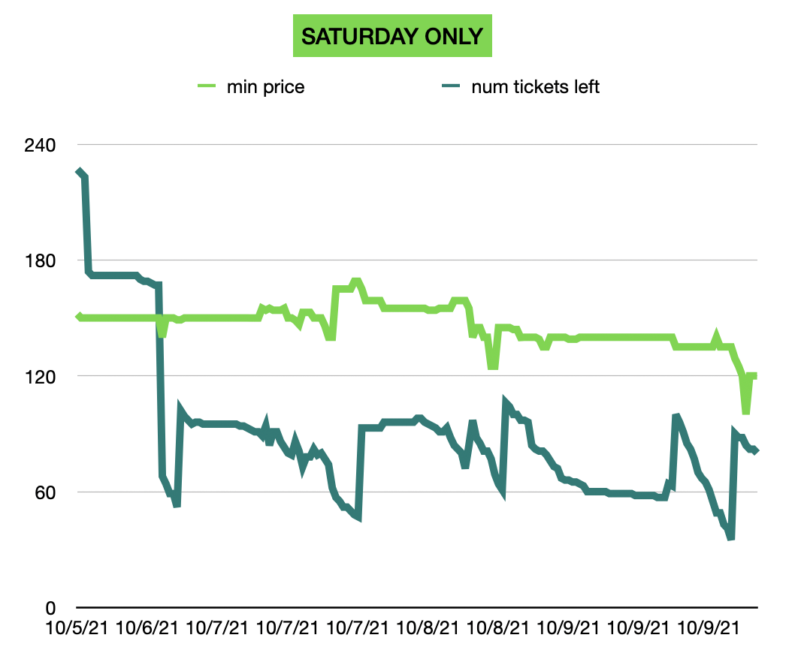
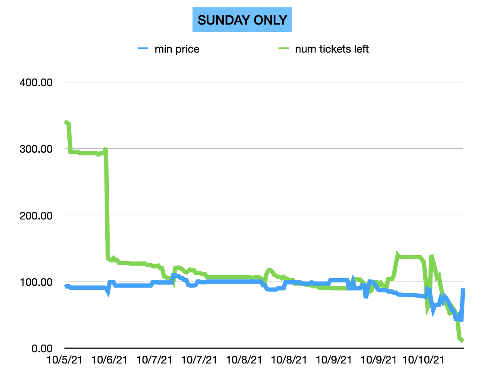

# Austin City Limits Festival 2021 Ticket Analysis 🎸🎟️

## Main Highlights

| Boxplot comparison shows ticket price variance across ticket types               | 
| ----------- | 
|                   

| 3-day minimum ticket price over time  | FRIDAY ONLY minimum ticket price over time |
| ----------- | ----------- |
|     |  |

| SATURDAY ONLY minimum ticket price over time  | SUNDAY ONLY minimum ticket price over time |
| ----------- | ----------- |
|     |  |

## Motivation
As a first-time ACL festival attendee, I wondered when the best time to buy tickets would be. Is it smarter to buy a week before the festival, or hours before the gates open? I turned to Python to find the hidden treasures in 2021 ticket price data.

## Methodology
For this project, I used StubHub’s APIs to request ticket information for the 2021 ACL Festival (weekend two). Starting three days prior (because the best ideas come in the shower), I wrote a Python script using task scheduling that makes API calls every 30 minutes to get the lowest ticket price and the number of tickets left. Finally, using the [gspread](https://docs.gspread.org/en/latest) API, it writes the data to a google sheet. Gspread tutorial [here](https://www.youtube.com/watch?v=ct0xvw_Z0tU)

## Requirements
- [StubHub developer account](https://developer.stubhub.com/getting-started)

## Notes
- The ticket prices exclude fees, which could be up to 30% of the selling price, which fluctuate based on demand. For example, a $200 ticket could be up to $260 after fees.
- Preprocessing the data: Sometimes, an API call returned a 0 value for the min ticket price. After the scraping was done, I removed all rows with 0 values for the min ticket price.

## Python Libraries Used
- gspread
- schedule
- requests
- matplotlib (and more)

## Things I Wish I Did Differently
- Started scraping data earlier. Since ACL occurs on two separate weekends, with ticket prices being roughly similar, it would have been helpful to start collecting data before Weekend 1 to possibly forecast the prices for Weekend 2.

## Potential Future Improvements

- Automated alerts when ticket prices or ticket supply dip(s) below a certain threshold
- Running the script on a Raspberry Pi
